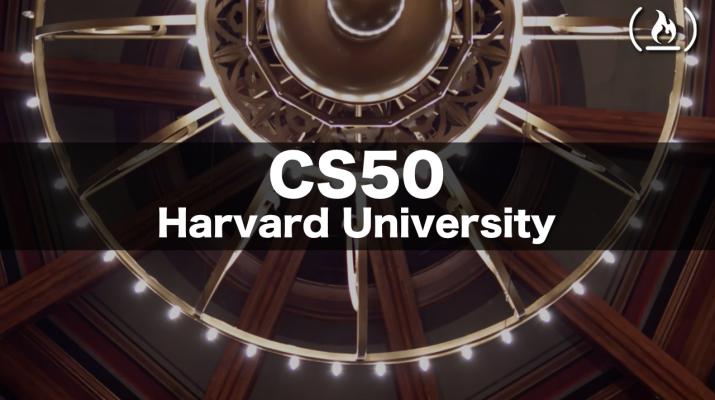

# CS50’s Introduction to Artificial Intelligence with Python

## Description
This repository contains my solutions to the CS50 AI course. This course explores the concepts and algorithms at the foundation of modern artificial intelligence, diving into the ideas that give rise to technologies like game-playing engines, handwriting recognition, and machine translation. The course is divided into 5 sections: Search, Knowledge, Uncertainty, Optimization, and Learning. Each section contains a number of problems that are solved using Python. The problems are solved using the following algorithms: Depth-first search, Breadth-first search, Uniform-cost search, A* search, Minimax, Alpha-beta pruning, K-nearest neighbors, Naive Bayes, Decision trees, Neural networks, and NLP. The course is taught by David J. Malan and can be found [here](https://cs50.harvard.edu/ai/2020/).

## Disclaimer
Du to the course policy; this reps does not contain any solution for the course assignments. It only contains a description of the course and a demo for my solutions for each project.

## Search
In this section, we learn about how to represent problems as a search problem, different search algorithms, adversarial search, and how to use search to solve problems.

### Project 0: Degrees

This project is a program that determines how many “degrees of separation” apart two actors are. The program takes as input a file containing a list of actors and their co-stars, and then prompts the user for two actors. The program then prints out the name of the two actors and the number of degrees of separation between them. The program uses breadth-first search to find the shortest path between the two actors.

Demo link: [Degrees](https://www.youtube.com/watch?v=Z0D7DfGLPao)

### Project 0: Tic-Tac-Toe

This project is a program that plays Tic-Tac-Toe. you can choose to play as X or O and the program will play the other player. The program uses minimax to determine the best move to make.

Demo link: [Tic-Tac-Toe](https://www.youtube.com/watch?v=pGiRpdILkxg)

## Knowledge
In this section, we learn about propositional logic and first-order logic. We also learn about how to use these logics to solve problems.

### Project 1: Knights

This project is a program that solves logic puzzles. The program takes as input a file containing a description of a logic puzzle, and then prints out a solution to the puzzle. The program uses constraint propagation to solve the puzzle.

Demo link: [Knights](https://www.youtube.com/watch?v=0roiJyEy7Ls)

### Project 1: Minesweeper

This project is a program that solves Minesweeper puzzles. you can play the game by clicking on the cells and the program will automatically solve the puzzle. The program uses constraint propagation to solve the puzzle.

Demo link: [Minesweeper](https://www.youtube.com/watch?v=nAchVlW3lls)

## Uncertainty
In this section, we learn about probability, Bayes’ rule, joint and conditional probability, bayesian networks, sampling, and hidden Markov models.

### Project 2: PageRank

This project is a program that ranks web pages by importance. The program takes as input a file containing a list of web pages and the links between them, and then prints out a ranked list of the web pages. The program uses PageRank to rank the web pages.

Demo link: [PageRank](https://www.youtube.com/watch?v=F-bKjH5VJyA)

### Project 2: Heredity

This project is a program that determines which people in a family have a particular genetic trait. The program takes as input a file containing a description of a family and the genetic traits that each person in the family has, and then prints out which people in the family have the genetic trait. The program uses Bayesian networks to determine which people have the genetic trait.

Demo link: [Heredity](https://www.youtube.com/watch?v=C_FAHxdLBe4)

## Optimization
In this section, we learn about different algorithms for local search such as Hill Climbing and Simulated Annealing, linear programming and Constraint Satisfaction

### Project 3: Crossword

This project is a program that generates crossword puzzles. The program takes as input a file containing a description of a crossword puzzle, and then prints out a completed crossword puzzle. The program uses constraint propagation to generate the crossword puzzle.

Demo link: [Crossword](https://www.youtube.com/watch?v=2x-_N62uxDM)

## Learning
In this section, we learn different algorithms for supervised learning such as k-nearest neighbors, Naive Bayes, and SVM. We also learn about different machine learning concepts such as overfitting and Regularization, unsupervised learning such as clustering, and Reinforcement Learning
### Project 4: Shopping

This project is a program that predicts whether online shopping customers will complete a purchase. The program takes as input a file containing a description of a shopping customer, and then prints out whether the customer will complete a purchase. The program uses k-nearest neighbors to predict whether the customer will complete a purchase.

Demo link: [Shopping](https://www.youtube.com/watch?v=nLe7DcYEG-0)

### Project 4: Nim

This project is a program that plays Nim. The program takes as input a file containing a description of a Nim game, and then prints out a solution to the game. The program uses reinforcement learning to solve the game.

Demo link: [Nim](https://www.youtube.com/watch?v=E72D2hrLVos)

## Neural Networks
In this section, we learn about the different components of a neural network such as neurons, layers, and activation functions. We also learn about different types of neural networks such as convolutional neural networks and recurrent neural networks.

### Project 5: Traffic

This project is a program that trains a convolutional neural network to identify which traffic sign appears in a photograph. The program is trained on a dataset of 43 different kinds of traffic signs. The program uses TensorFlow to train the neural network.

Demo link: [Traffic](https://www.youtube.com/watch?v=Gb0gqGpSEPw)

## Language
In this section, we learn about how AI can be used to solve problems involving language, some of NLP tasks, how to represent languages with context-free grammars, language models such as Markov models and n-grams, and word embeddings such as tf-idf and word2vec.

### Project 6: Parser

This project is a program that parses sentences and extracts noun phrases. The program takes as input a file containing a description of a sentence, and then prints out the noun phrases in the sentence. The program uses context-free grammars to parse the sentence.

Demo link: [Parser](https://www.youtube.com/watch?v=EbP09JH-fYk)

### Project 6: Questions

This project is a program that answers questions. The program takes as input a file containing a description of a question, and then prints out an answer to the question. The program uses natural language processing to answer the question.

Demo link: [Questions](https://www.youtube.com/watch?v=b8YASAOK5EU)

